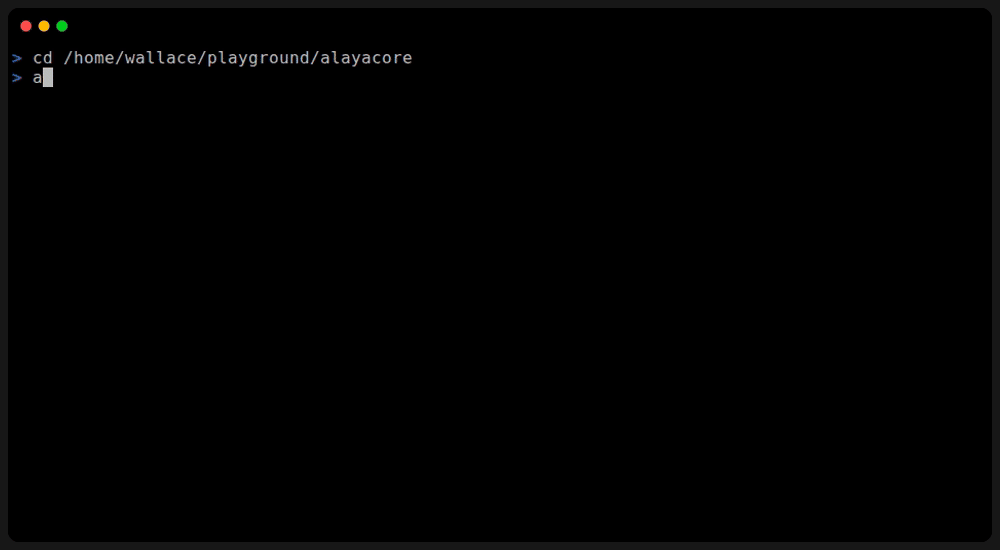
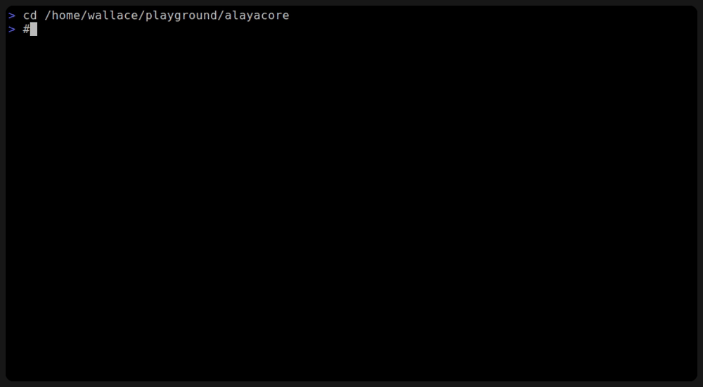

# AlayaCore

[English](README.md) | [中文](README.zh-CN.md)

A fast, minimal AI Agent that runs in your terminal.

**TUI Mode** — split-pane interface with streaming output, vim navigation, and session management.



**Plain IO Mode** — stdin/stdout for scripts, pipes, and non-interactive use.



AlayaCore connects to any OpenAI-compatible or Anthropic-compatible LLM and gives it the tools to read, write, and edit files, and execute commands — all from an interactive TUI with streaming output, session persistence, and multi-step agentic tool-calling loops.

## Quick Start

**Option 1: Download from [GitHub Releases](https://github.com/alayacore/alayacore/releases)**

Download the binary for your platform, extract it, and add it to your `PATH`.

**Option 2: Install with Go**

```sh
go install github.com/alayacore/alayacore@latest
```

Then run `alayacore`.

On first run, AlayaCore auto-creates a default model config at `~/.alayacore/model.conf` configured for Ollama. Edit it to point at your preferred provider — press `Ctrl+L` then `e` in the terminal, or edit the file directly.

## Features

- **Autonomous tool-calling loop** — The LLM plans, calls tools, and iterates until the task is done. Up to 100 steps per prompt.
- **Five built-in tools** — `read_file`, `edit_file`, `write_file`, `execute_command`, `search_content` (when ripgrep `rg` is available).
- **Cross-platform** — Runs on Linux, macOS, and Windows. The `execute_command` tool auto-detects the shell (bash/zsh/sh on Unix, PowerShell/cmd on Windows).
- **Any LLM provider** — OpenAI, Anthropic, DeepSeek, Qwen, Ollama, LM Studio. Multiple models in one config, switch at runtime.
- **Streaming TUI** — Real-time output with virtual scrolling, foldable windows, and vim-like keybindings.
- **Plain IO mode** — `--plainio` for scripting and piping. No TUI, just stdin/stdout.
- **Session persistence** — Save and resume conversations with auto-save.
- **Skills system** — Extend the agent with instruction packages following the [Agent Skills](https://agentskills.io) spec.
- **Themes** — Customizable color schemes with live switching.

## Documentation

| Document | Description |
|----------|-------------|
| [Getting Started](docs/getting-started.md) | Installation, CLI flags, and usage examples |
| [Configuration](docs/configuration.md) | Model config, runtime config, and themes |
| [Terminal UI](docs/tui.md) | Keybindings, commands, windows, task queue |
| [Plain IO Mode](docs/plainio.md) | stdin/stdout for scripts and pipes |
| [Skills System](docs/skills.md) | Agent Skills specification, directory structure, SKILL.md format |
| [Architecture](docs/architecture.md) | Layered architecture, TLV protocol, data flow, design decisions |

## License

MIT
