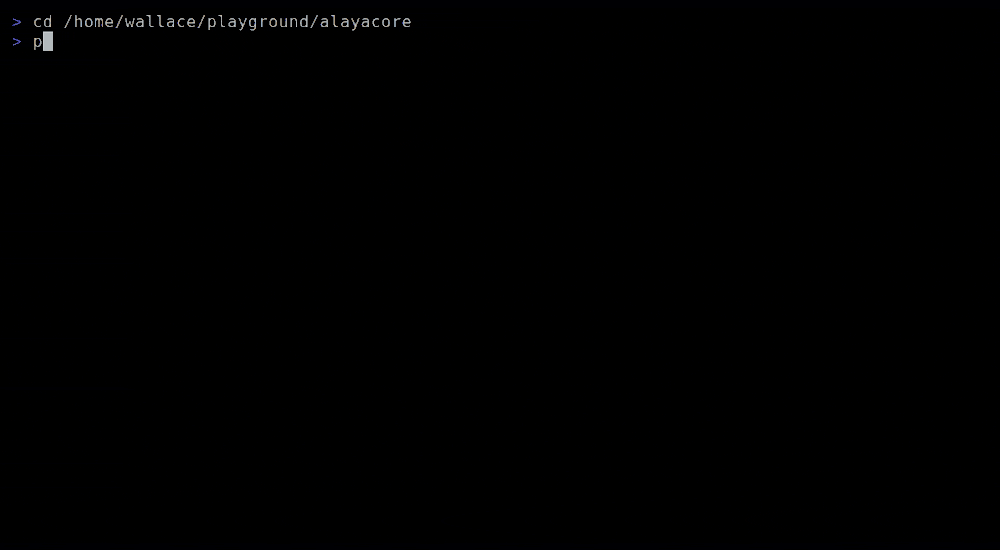

# AlayaCore

[English](README.md) | [中文](README.zh-CN.md)

[]()
[]()
[](https://github.com/alayacore/alayacore/releases)

一个快速、极简的 AI Agent，适用于终端、脚本和程序化控制。

## 目录

- [模式](#模式)
- [快速开始](#快速开始)
- [功能特性](#功能特性)
- [系统要求](#系统要求)
- [从源码构建](#从源码构建)
- [Anthropic API 说明](#anthropic-api-说明)
- [文档](#文档)
- [许可证](#许可证)

## 模式

**TUI 模式** — 分栏界面，支持流式输出、Vim 导航和会话管理。


**Plain IO 模式** — 通过 stdin/stdout 支持脚本、管道和非交互式使用。


**Raw IO 模式** — 完整的控制权，通过原始 TLV 帧与其他程序集成（stdin/stdout）。



AlayaCore 可连接任何兼容 OpenAI 或 Anthropic 的 LLM，并为其提供读取、写入、编辑文件和执行命令的能力——支持会话持久化和多步骤智能工具调用循环。相同的 Agent 核心驱动所有三种模式：**TUI**（交互式终端界面）、**Plain IO**（stdin/stdout 脚本模式）和 **Raw IO**（原始 TLV 帧程序化控制模式）。

## 快速开始

**方式一：** 从 [GitHub Releases](https://github.com/alayacore/alayacore/releases) 下载对应平台的二进制文件，解压后将其添加到 `PATH` 环境变量中。

**方式二：** 使用 Go 安装：

```sh
go install github.com/alayacore/alayacore@latest
```

然后运行 `alayacore`。

首次运行时，AlayaCore 会自动在 `~/.alayacore/model.conf` 创建默认模型配置，预配置为 Ollama。你可以编辑该文件以指向你偏好的提供商。

> 查看[快速入门指南](docs/getting-started.md)了解 CLI 参数、示例和详细设置。

## 功能特性

- 🤖 **自主工具调用循环** — LLM 规划、调用工具并迭代，直到任务完成（默认无步骤限制，可通过 `--max-steps` 可选设限）。
- 🛠️ **五种内置工具** — `read_file`、`edit_file`、`write_file`、`execute_command`、`search_content`（需安装 ripgrep `rg`）。
- 🌐 **跨平台** — 支持 Linux、macOS 和 Windows。`execute_command` 工具可自动检测 shell（Unix 上为 bash/zsh/sh，Windows 上为 PowerShell/cmd）。
- 🧠 **支持任何 LLM 提供商** — OpenAI、Anthropic、DeepSeek、Qwen、Ollama、LM Studio。一个配置文件支持多个模型，运行时可切换。
- 🖥️ **流式 TUI** — 实时输出，支持虚拟滚动、可折叠窗口和类 Vim 快捷键。
- 📟 **Plain IO 模式** — `--plainio` 用于脚本和管道。无 TUI，仅 stdin/stdout。
- 🔌 **Raw IO 模式** — `--rawio` 用于程序化控制。stdin/stdout 上的原始 TLV 帧。
- 💾 **会话持久化** — 支持保存和恢复对话，使用 `--session` 时自动保存。
- 🎯 **技能系统** — 可按照 [Agent Skills](https://agentskills.io) 规范扩展指令包来增强 Agent 能力。
- 🎨 **主题** — 可自定义配色方案，支持实时切换。
- ✅ **可配置的工具确认** — 通过 `--tool-confirm` 对指定工具要求手动批准。

## 系统要求

- **操作系统**：Linux、macOS 或 Windows
- **可选**：[ripgrep](https://github.com/BurntSushi/ripgrep) (`rg`) — 启用 `search_content` 工具

## 从源码构建

**前置要求**：[Go 1.26.1+](https://go.dev/dl/)

```sh
git clone https://github.com/alayacore/alayacore.git
cd alayacore
go build -o alayacore .
```

**运行测试**：

```sh
go test ./...
```

## Anthropic API 说明

AlayaCore **不在请求体中发送** Anthropic 专用的 `cache_control` 字段。本项目面向兼容 Anthropic 协议的提供商（DeepSeek、MiniMax、MiMo、Ollama、LM Studio 等），这些提供商透明地处理缓存。

如果你直接连接 Anthropic API 并希望使用提示缓存，请在 AlayaCore 与 Anthropic 之间放置一个代理，在 JSON 请求体中注入 `"cache_control":{"type":"ephemeral"}`。可使用 [mitmproxy](https://mitmproxy.org/)、OpenResty（nginx + Lua）或自行编写小型脚本等方式实现。

详见 [providers.md](docs/providers.md) 中提供商相关的注意事项。

## 文档

| 文档 | 说明 |
|------|------|
| [快速入门](docs/getting-started.md) | 安装、CLI 参数和使用示例 |
| [命令](docs/commands.md) | 所有会话命令（`:save`、`:cancel`、`:fork` 等） |
| [配置](docs/configuration.md) | 模型配置、运行时配置和主题 |
| [终端 UI](docs/tui.md) | 快捷键、命令、窗口、任务队列 |
| [Plain IO 模式](docs/plainio.md) | 用于脚本和管道的 stdin/stdout |
| [Raw IO 模式](docs/rawio.md) | 用于程序化控制的原始 TLV 帧 |
| [TLV 示例](tlv-samples/README.md) | Raw IO 协议参考用的 TLV 示例消息 |
| [技能系统](docs/skills.md) | Agent Skills 规范、目录结构、SKILL.md 格式 |
| [架构](docs/architecture.md) | 分层架构、TLV 协议、数据流、设计决策 |
| [步骤消息](docs/step-messages.md) | 智能体步骤中的消息结构（assistant + tool 结果） |
| [提供商](docs/providers.md) | 提供商特定的注意事项（tool call 分块、null 参数、推理模式） |
| [上下文跟踪](docs/context-tracking.md) | 上下文令牌的跟踪与显示方式 |
| [错误处理](docs/error-handling.md) | LLM API 错误检测与传播 |
| [工具执行](docs/tool-execution.md) | 并发 + 延迟的工具执行策略 |
| [输出截断](docs/truncation.md) | 大型工具输出的上下文预算处理方式 |

**内部设计文档**：[docs/internal/](docs/internal/)

## 许可证

MIT
